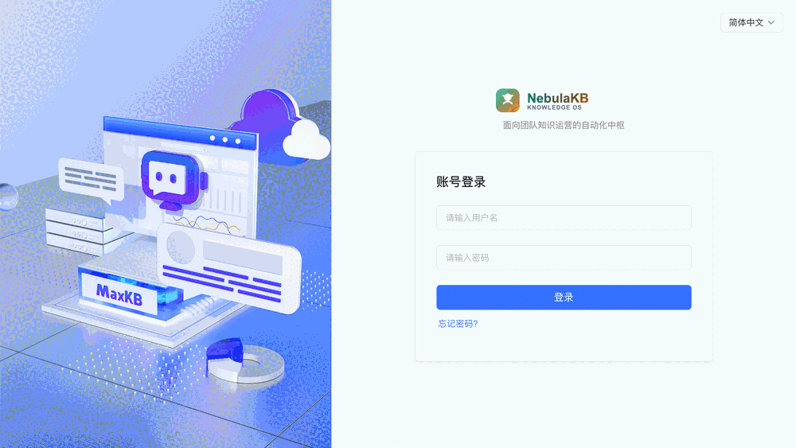
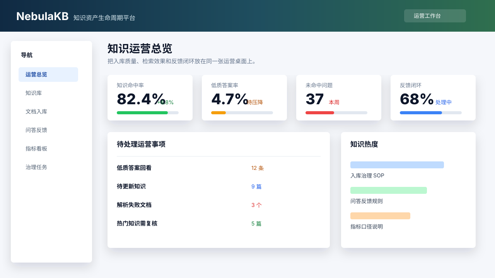
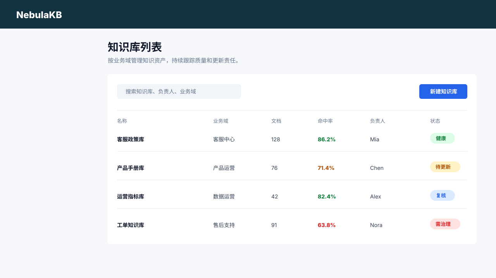
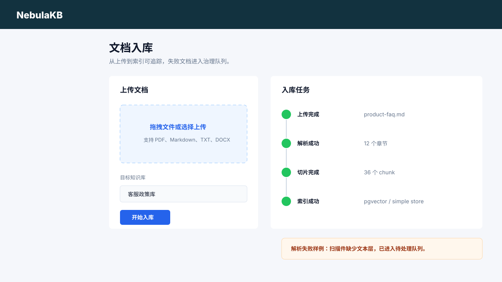
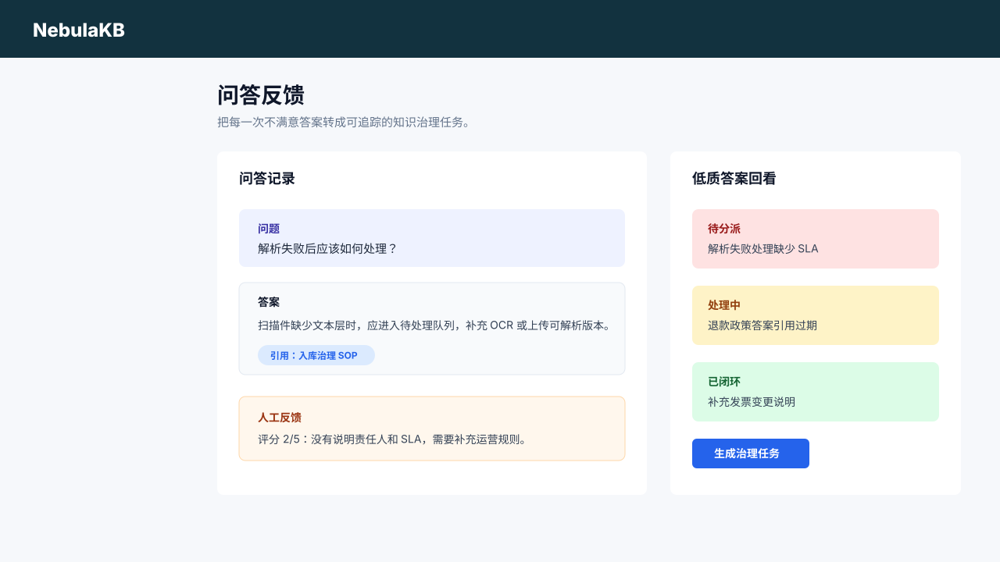

# NebulaKB - 知识资产生命周期平台 | Knowledge Operations Hub

[](https://github.com/however-yir/nebula-kb/actions/workflows/build-and-push.yml)
[](https://github.com/however-yir/nebula-kb/actions/workflows/nebulakb-tests.yml)
[](./docs/)
[](./LICENSE)
[](https://github.com/however-yir/nebula-kb)

> **Matrix role:** `nebula-kb` owns the knowledge asset lifecycle: ingestion, governance, retrieval quality, feedback loops, and operations dashboards. For the Spring AI backend platform layer, see [`knowledgeops-agent`](https://github.com/however-yir/knowledgeops-agent).
>
> Status: `active`
>
> Matrix: [knowledgeops-agent](https://github.com/however-yir/knowledgeops-agent) · [tianji-ai-agent](https://github.com/however-yir/tianji-ai-agent) · [nebula-kb](https://github.com/however-yir/nebula-kb) · [forgepilot-studio](https://github.com/however-yir/forgepilot-studio) · [however-microservices-lab](https://github.com/however-yir/however-microservices-lab)

**NebulaKB** is a local-first knowledge asset lifecycle platform for teams that need measurable knowledge quality — combining document ingestion, semantic indexing (pgvector), retrieval-augmented Q&A, human feedback loops, and an operations dashboard. Built with Django, PostgreSQL, and Redis. For the enterprise Spring AI RAG backend, see [knowledgeops-agent](https://github.com/however-yir/knowledgeops-agent).

NebulaKB 面向知识运营团队，不是泛泛的知识库或 RAG 示例，而是把知识资产的入库、治理、检索、反馈、回看和运营后台串成一条可演示、可测试、可度量的工作流。

> 定位一句话：NebulaKB 负责让知识资产持续变好，knowledgeops-agent 负责提供 Spring AI 企业后端工程基线。



## 项目快照

- 定位：知识资产生命周期平台，而不是通用聊天工作台。
- 亮点：Django + PostgreSQL + Redis、多模型接入、知识资产生命周期、检索链路可观测、质量评测闭环。
- 最短运行路径：`python apps/manage.py migrate && python main.py dev web`
- 作品矩阵角色：`NebulaKB` 负责知识资产运营层，和企业 RAG 后端、业务 Agent、AI 工程执行平台、云原生微服务实验室形成互补。
- 证据索引：[docs/evidence/README.md](docs/evidence/README.md)

## 与 knowledgeops-agent 的边界

| 维度 | NebulaKB | knowledgeops-agent |
|---|---|---|
| 主定位 | 知识资产生命周期平台 | 企业级 Spring AI RAG 后端平台 |
| 关键用户 | 知识运营、客服质检、内容治理、业务管理员 | 后端工程师、AI 平台工程师、架构负责人 |
| 关键链路 | 文档入库、解析、切片、索引、检索问答、反馈闭环、低质答案回看 | Spring AI 接入、租户隔离、异步任务、鉴权审计、可观测、部署基线 |
| 产品表面 | 运营后台、知识库列表、文档入库、问答反馈、质量指标 | API、Spring Boot 服务、鉴权、队列、向量库、监控栈 |
| 成功标准 | 知识命中率提升、低质答案率下降、未命中问题可治理 | 后端能力完整、接口稳定、部署和观测可验证 |

## 产品截图

| 运营后台 | 知识库列表 |
|---|---|
|  |  |

| 文档入库 | 问答反馈 |
|---|---|
|  |  |

## 生命周期验证资产

| 阶段 | 平台能力 | 验证资产 |
|---|---|---|
| 入库 | 文件上传、来源登记、知识库归属、租户边界 | `demo-data/knowledge-sample/`、`apps/knowledge/tests.py` |
| 治理 | 解析状态、失败原因、切片结果、待更新标记 | `apps/knowledge/services/asset_lifecycle_demo.py` |
| 检索 | 命中排序、引用返回、空结果兜底 | `scripts/demo_lifecycle.py` |
| 反馈 | 人工评分、低质答案沉淀、闭环状态 | `docs/demo-script.md` |
| 运营 | 知识命中率、低质答案率、未命中问题、热门知识、待更新知识 | `docs/observability.md` |

## 矩阵角色

NebulaKB 是 however-yir AI 工程作品矩阵中的“知识运营中枢”，负责展示知识资产从文档接入、解析、切片、索引、检索，到问答反馈、低质答案回看和知识质量优化的生命周期闭环。完整项目矩阵见 [docs/project-matrix.md](docs/project-matrix.md)。

## 同系列相关项目

| Repo | 角色 | 与 NebulaKB 的关系 |
|---|---|---|
| [`local-ai-hub`](https://github.com/however-yir/local-ai-hub) | 本地 AI 工作台与统一入口 | 更偏模型接入、本地工具台和团队日常使用入口 |
| `yourrag` | 企业 RAG / Agent 交付参考 | 更偏私有化交付方案和 RAG + Agent 组合实践，核心引擎内嵌于 [`engines/yourrag/`](engines/yourrag/) |

## 目录

- [1. 项目概述](#1-项目概述)
- [2. 目标与场景](#2-目标与场景)
- [3. 核心能力](#3-核心能力)
- [4. 技术栈](#4-技术栈)
- [5. 仓库结构](#5-仓库结构)
- [6. Quick Start](#6-quick-start)
- [7. 配置建议](#7-配置建议)
- [8. 开发与测试](#8-开发与测试)
- [9. 协作与发布](#9-协作与发布)
- [10. 路线图](#10-路线图)
- [11. 贡献指南](#11-贡献指南)
- [12. License](#12-license)

## 1. 项目概述

本仓库围绕知识资产生命周期组织代码和文档：知识进入系统后，要能被解析、切片、索引、检索、反馈、回看和持续治理。它的价值不只是“能问答”，而是把知识命中率、低质答案、待更新知识和运营后台放到同一条可演示链路里。

## 2. 目标与场景

适用场景：

- 作为业务功能开发与验证的基础仓库。
- 作为团队内部协作与知识沉淀的载体。
- 作为后续扩展和二次开发的起点。

相对主作品矩阵与同系列项目的职责边界：

- `NebulaKB` 更像知识入库、知识治理、检索问答与质量反馈闭环平台。
- `knowledgeops-agent` 更偏企业级 Spring AI RAG 后端、安全治理与可观测基线。
- `tianji-ai-agent` 更偏业务 Agent 流程、Tool Calling、多智能体路由和课程业务闭环。
- `forgepilot-studio` 更偏 AI 工程执行、任务编排、审计回放和团队工作台。
- `however-microservices-lab` 更偏云原生微服务、多语言服务治理、Kubernetes 和 AI 服务集成。
- `local-ai-hub` 与 `yourrag` 作为同系列相关项目，分别偏本地 AI 工作台和企业 RAG/Agent 交付参考。

## 3. 核心能力

- 支持知识入库、索引、检索与问答闭环。
- 支持本地化部署与可控的数据边界。
- 支持持续扩展知识源与应用场景。
- **安全加固**：SECRET_KEY 生产环境强制校验、DRF 速率限制、SSO (OIDC/SAML) 接入、审计日志脱敏、安全响应头。
- **可观测性**：Prometheus 指标暴露、OpenTelemetry 链路追踪、Grafana 预置仪表盘、Celery Flower 监控。
- **数据库运维**：自动化备份（Celery 任务 + cron 脚本）、PgBouncer 连接池、HNSW 索引可调参数。
- **CI/CD**：60% 覆盖率门禁、Vitest 前端测试、Helm Chart、Docker 非 root 运行。
- **性能优化**：检索结果缓存、Gunicorn 可配 workers/threads、Celery 并发可配、LLM Fallback 降级。
- **API 版本化**：`/api/v1/` 前缀路由、知识版本管理、批量导入导出。

### 3.1 典型用例

| 场景 | 主要模块 | 目标结果 |
|---|---|---|
| 文档入库与解析 | `apps/knowledge` | 把资料转为可检索知识资产 |
| 检索问答与运营 | `apps/chat`, `ui/` | 形成知识问答与后台运营闭环 |
| 模型接入与切换 | `apps/models_provider`, `apps/local_model` | 对接本地或远端模型 |
| 安装与部署 | `installer/` | 本地快速起服与依赖初始化 |
| 应用扩展 | `apps/application`, `appstore/nebula.json` | 面向后续插件化或应用化拓展 |

### 3.2 模块职责矩阵

| 路径 | 角色 |
|---|---|
| `apps/knowledge` | 知识库核心、入库与检索相关能力 |
| `apps/chat` | 问答交互与知识调用入口 |
| `apps/models_provider` | 模型提供方接入层 |
| `apps/common` / `apps/system_manage` | 平台公共与系统管理能力 |
| `installer/` | 本地部署、数据库与 Redis 启动辅助 |
| `ui/` | 管理后台与问答前端（Vue 3 + Vite + TypeScript + Ant Design） |

## 4. 技术栈

- **后端**：Python 3.11 · Django 5.2 · DRF · Celery · django-prometheus
- **数据**：PostgreSQL + pgvector · Redis · django-redis 缓存
- **AI/LLM**：LangChain · LangGraph · OpenAI / Anthropic / DeepSeek / Ollama / DashScope 等多模型接入
- **前端**：Vue 3 · Vite · Vitest
- **部署**：Docker · Helm (Kubernetes) · PgBouncer · Gunicorn
- **CI/CD**：GitHub Actions · coverage 60% 门禁 · pip-audit 依赖审计 · Helm lint

## 5. 仓库结构

建议优先阅读：

- `README.md`：项目入口与整体说明。
- `README_CN.md`：更细化的中文交付说明。
- `apps/`、`ui/`：后端与界面主目录。
- `installer/`：安装、初始化与部署辅助脚本。

## 6. Quick Start

1. 克隆仓库并进入目录：

```bash
git clone https://github.com/however-yir/nebula-kb.git
cd nebula-kb
```

2. 安装依赖并初始化：

```bash
python -m venv .venv
source .venv/bin/activate
pip install -U pip
[ -f requirements.txt ] && pip install -r requirements.txt
[ -f pyproject.toml ] && pip install -e .
python apps/manage.py migrate
```

3. 启动开发环境：

```bash
python main.py dev web
```

### 启动前端

```bash
cd ui
npm ci
npm run dev      # 管理后台 (http://localhost:5173)
npm run chat     # 问答界面 (http://localhost:5174)
```

### 6.1 本地依赖一键准备（PostgreSQL / Redis / 可选 Ollama）

首次启动建议先执行：

```bash
cp .env.example .env
# 修改 .env 中所有 CHANGE_ME_* 密码

./scripts/bootstrap-local.sh --start
# 如需一起拉起 Ollama:
# ./scripts/bootstrap-local.sh --start --with-ollama
```

该脚本会：

1. 校验 `.env` 是否存在并阻止占位密码直接启动；
2. 按 `docker-compose.dev.yml` 拉起 PostgreSQL / Redis；
3. 自动确保 `pgvector` 扩展已启用；
4. 可选拉起本地 Ollama，降低首次联调门槛。

### 6.2 极速安装脚本（macOS / Windows）

macOS:

```bash
./scripts/quick-install-mac.sh
# 如需一起拉起 Ollama:
# ./scripts/quick-install-mac.sh --with-ollama
```

Windows (PowerShell):

```powershell
powershell -ExecutionPolicy Bypass -File .\scripts\quick-install-win.ps1
# 如需一起拉起 Ollama:
# powershell -ExecutionPolicy Bypass -File .\scripts\quick-install-win.ps1 -WithOllama
```

快速脚本会自动完成：

1. 初始化 `.env` 并替换 `CHANGE_ME_*` 占位密钥；
2. 创建 `.venv` 并安装 Python 依赖；
3. 拉起 PostgreSQL / Redis（可选 Ollama）并确保 `pgvector`；
4. 执行数据库迁移。

## 7. 配置建议

建议按 `dev / staging / prod` 分层配置，并将密钥类信息放入环境变量或密钥管理系统。

### 7.1 部署形态矩阵

| 形态 | 入口 | 适合场景 |
|---|---|---|
| 开发模式 | `python main.py dev web` | 本地功能开发 |
| 一键本地启动 | `installer/start-all.sh` | 演示与快速验证 |
| 分组件启动 | `installer/start-postgres.sh` / `installer/start-redis.sh` / `installer/start-maxkb.sh` | 更接近生产的联调环境 |
| 可运维分离部署 | `docker compose -f deploy/docker-compose.operational.yml up -d` | web / worker / scheduler / PostgreSQL / Redis / object storage 独立部署 |

运维部署、环境变量契约、健康检查、备份恢复和回滚流程见 [docs/ops/operability.md](docs/ops/operability.md) 与 [docs/ops/postgres-backup-restore.md](docs/ops/postgres-backup-restore.md)。

## 8. 开发与测试

推荐流程：

1. 基于默认分支创建功能分支。
2. 小步提交并保持提交目标单一。
3. 本地完成构建与测试后再推送。
4. 通过 Pull Request 完成评审与合并。

本地验证入口：

```bash
python apps/manage.py check
python apps/manage.py test apps.knowledge
cd ui && npm ci && npm test && npm run type-check && npm run build
bash scripts/quality-gate.sh all          # 覆盖率 + lint + 结构检查
helm lint deploy/helm/nebula-kb           # Helm Chart 校验
python scripts/demo_lifecycle.py
```

### 8.1 评测与验收路径

建议把以下链路作为最小验收闭环：

1. 导入一组真实文档并验证索引完成。
2. 对同一问题做检索命中检查与答案可解释性检查。
3. 验证不同模型提供方下的响应一致性与延迟。
4. 校验后台管理入口、知识集管理与权限边界是否稳定。

## 9. 协作与发布

建议使用语义化版本，发布说明应包含新增、修复与兼容性说明。

## 10. 路线图

### 已完成 (v2.0.0)

- [x] SECRET_KEY 生产环境强制校验
- [x] DRF 速率限制 (Anon/User/KnowledgeSearch)
- [x] SSO 框架 (OIDC/SAML Provider 模型)
- [x] 审计日志中间件（敏感字段脱敏）
- [x] 安全响应头中间件
- [x] django-prometheus 指标暴露
- [x] OpenTelemetry 链路追踪中间件
- [x] Grafana 预置仪表盘 + 数据源配置
- [x] Celery Flower 服务
- [x] 自动化备份任务 + cron 脚本
- [x] PgBouncer 连接池服务
- [x] HNSW 索引参数可配置
- [x] CI 覆盖率门禁 60%
- [x] Vitest 前端测试框架
- [x] Helm Chart (Kubernetes 部署)
- [x] Docker 非 root 用户运行
- [x] 检索结果缓存
- [x] Gunicorn workers/threads 可配置
- [x] Celery 并发可配置
- [x] LLM Fallback 降级管理器
- [x] API v1 路由前缀
- [x] 知识版本管理序列化器
- [x] 批量导入导出序列化器

### 后续规划

1. 稳定主流程与关键接口。
2. 优化模块边界与可观测性。
3. 完善自动化测试与文档体系。

## 11. 贡献指南

提交建议包含：变更背景、实现说明、验证结果、风险评估。

## 12. License

请以仓库内现有 License 文件为准。
