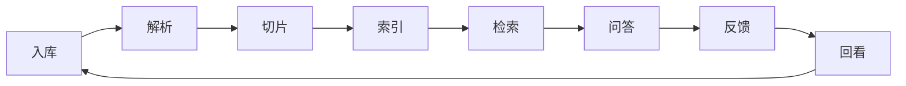

# NebulaKB 项目定位

## 一句话

NebulaKB 是知识资产生命周期平台，负责让知识资产持续变好 —— 从入库、解析、索引、检索，到问答反馈和低质答案治理。

## 在 however-yir 作品矩阵中的位置

| 维度 | NebulaKB | knowledgeops-agent | tianji-ai-agent | forgepilot-studio | however-microservices-lab |
|---|---|---|---|---|---|
| 主语言 | Python/Django | Java/Spring Boot | Java/Spring Boot | Python/FastAPI | Go/Python/Node/Java/C# |
| 核心用户 | 知识运营、内容治理、业务管理员 | 后端工程师、AI 平台工程师、架构负责人 | 面试官、招聘方、学习者 | 研发团队、技术管理者 | 架构师、面试官 |
| 关键链路 | 知识入库→治理→检索→反馈→运营 | RAG→租户隔离→异步入库→鉴权审计→可观测 | 意图路由→ToolCall→SSE→卡片 | 任务协议→执行→审计→报告 | 多语言服务→K8s→AI 接入 |
| 不做的事 | 不提供企业级 JWT/RBAC 后端引擎 | 不做知识运营后台 UI | 不做通用 Agent 框架 | 不自研 Agent 运行时 | 不做单语言微服务框架 |

## 与同系列项目的边界

### vs knowledgeops-agent

NebulaKB 管"知识好不好"，knowledgeops-agent 管"后端稳不稳"。

NebulaKB 面向知识运营人员，提供文档入库、解析状态、检索命中、人工评分、低质答案回看的运营后台。knowledgeops-agent 面向后端工程师，提供 Spring AI RAG 引擎、租户隔离、JWT/RBAC、异步入库队列、可观测栈和回归评测。

两者可以组合：NebulaKB 做知识运营前台，knowledgeops-agent 做 RAG 后端引擎。但当前阶段各自独立闭环更有展示价值 —— NebulaKB 用 Django 管理知识资产生命周期，knowledgeops-agent 用 Spring AI 证明企业级 Java RAG 工程能力。

### vs local-ai-hub

local-ai-hub 偏向本地 AI 工作台和统一模型入口，解决"在哪用模型、用哪个模型"的问题。NebulaKB 偏向知识资产的业务运营，解决"知识从哪来、好不好用、怎么变好"的问题。

local-ai-hub 可以作为 NebulaKB 的模型接入层之一，但 NebulaKB 自身也内置了 `apps/models_provider` 和 `apps/local_model` 做模型切换。

### vs yourrag

yourrag 偏向企业私有化 RAG/Agent 交付方案，解决"怎么把 RAG 部署到客户机房"的问题。NebulaKB 偏向知识资产生命周期管理，解决"部署之后知识怎么持续运营"的问题。

yourrag 提供 RAG 引擎的私有化交付，NebulaKB 管理 RAG 喂进去的知识质量。

### vs tianji-ai-agent

tianji-ai-agent 是业务 Agent 工程案例，围绕课程咨询/推荐/购买的单一业务闭环，展示多智能体路由和 Tool Calling 的工程写法。NebulaKB 是知识运营平台，不绑定单一业务领域，面向通用知识资产的入库和治理。

## 不做的事

- 不做通用聊天助手 —— 那是 ChatGPT、Claude 等产品的事
- 不做企业级鉴权和多租户后端 —— 那是 knowledgeops-agent 的事
- 不做 Agent 任务编排和执行沙箱 —— 那是 forgepilot-studio 的事
- 不做多语言微服务治理和 K8s 部署样板 —— 那是 however-microservices-lab 的事
- 不做单一业务的 Agent 流程演示 —— 那是 tianji-ai-agent 的事
- 不做本地模型统一入口和工作台 —— 那是 local-ai-hub 的事

## 知识资产生命周期

这是 NebulaKB 区别于其他知识库项目（包括通用 RAG demo）的核心差异：

每个阶段都有对应的平台能力和验证资产，见 README 中的"生命周期验证资产"表。

## 适用场景

- 企业知识库运营：文档持续入库、知识质量监控、低质答案治理
- 客服知识质检：检索命中率、答案正确率、未命中问题归因
- 内容团队知识沉淀：把散落文档变成可检索、可反馈、可迭代的知识资产
- 面试展示：证明你能设计知识运营闭环，而不是只写了一个 embedding + LLM 的问答脚本
